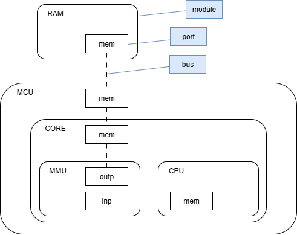
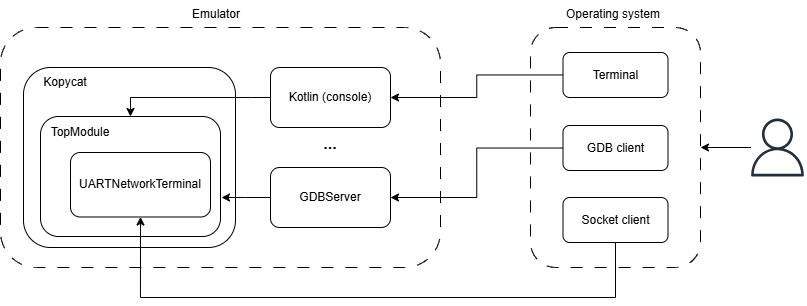

[Читать на русском](README-ru.md)

# About the project
## Description

**Kopycat** is a multi-processor architectures system and user-level (with VEOS module) emulator.

**Main features** are:

- Easy to assemble a new device. Configure your own platform using Kotlin.
- Easy to customize. Create your own platform-module using Kotlin.
- Cross-platform. Kopycat uses JVM as a backend and can be run on Windows, Linux and OSX.
- One-to-one correspondence. Virtual platform representation is identical to block diagram.
- Multiple supported architectures: MIPS, ARM, MSP430, v850ES, x86.
- User-level mode. Can emulate a standalone ELF-file without full system emulation.

This project contains:

**CPU cores:** ARMv6, ARMv6M, ARMv7, MIPS, MSP430, v850ES, x86, PowerPC (E500v2)

**MCUs:** Cortex-M0, STM32F0xx, MSP430x44x, PIC32MZ, P2020, Atom 2758, ElanSC520

## Origin
The history of the project began with the need to emulate a device with a rare processor architecture.  
At that time, existing platforms for emulating hardware devices (like QEMU) did not support this architecture.  
There were two ways to solve the problem:
1. Modifying existing software.
2. Building our own solution.

We decided to go with the second option.

Besides emulating the target architecture, the Kopycat project had other goals to make emulating specific devices easier in the future, such as:
- *Easy development*: To make it simple to add new architectures and modules, we chose Kotlin as the programming language because it has many helpful syntax features.
- *Advanced interaction tools*: Kopycat includes tools for flexible interaction with the emulation process. For example, it has "tracers" that describe the logic executed for each assembly instruction of the device. With these, you can, for example, build a call stack for a program without its source code or even change how the emulator works.
- *Integration with other tools*: To allow Kopycat to work with other software, we added remote procedure call (rpc) and REST API protocols.  

Of course, using the JVM together with tracers and other extra emulator features affects its speed. That’s why another important feature is creating "snapshots"—saved states that let you restart the emulator from a specific point.

## Architecture
Kopycat has a modular architecture, which makes it quick to create an emulator for any hardware platform.  
The modules form a hierarchy of components, where the emulated device is called the top module.  
The modules interact with each other using a bus architecture. Buses, in turn, connect to modules through ports.  
Here’s an example of a simple architecture:  


This approach lets you describe a device’s architecture in a way that matches its physical block diagram during development.

The top module is initialized in an instance of the Kopycat class. A Kotlin console is provided to manage the emulator.  
Protocols like gdb, rest, and rpc are also available. To allow connections to the emulated device’s system, the UartNetworkTerminal class is used.  
Overall, the virtual device and its interaction with the main operating system can be shown in this diagram:  


___

# User Guide

Here you can find a guide on how to launch and get started with the *Kopycat* emulator from scratch.  
Fast overview:
- The first step is to obtain a Linux distribution that will be loaded into the emulator. This section describes how to build the distribution using the Buildroot utility.
- Next, the deployment process of the emulator is explained so you can begin to work with it.
- Finally, after the emulator has been launched, we cover how to work with networking (E1000) and disk (SATA) devices. The section helps expand your usage of *Kopycat*, especially for working with networking and disk.

>**_NOTE:_** The guide implies, that you have already cloned *Kopycat* project on your device. If not:`git clone https://github.com/inforion/kopycat.git`

___

## Prerequisites
To use Kopycat, ensure you have the following installed:
- **Java Development Kit (JDK) 11**
- **Socat**: For terminal interaction
- **Git**
- **Docker or Podman** (optional)

___

## 1. Preparing the Distribution using Buildroot
**Buildroot** is a tool that simplifies and automates the process of building a complete Linux system for embedded devices using cross-compilation.

You can configure the toolchain and kernel via `make menuconfig` and `make linux-menuconfig`, which provide a text-based user interface. The full build is triggered with `make`.

After configuration and build, the artifacts will be located in the `./output/images` directory.

For more information, refer to the official documentation — [Buildroot - Making Embedded Linux Easy](https://buildroot.org/docs.html)

___

### Building the Kernel for kopycat x86 (Version 0.11.0+)
Inside the `./kopycat-modules/tops/demolinux/src/main/buildroot` directory, you'll find a `Containerfile` to build an image using Buildroot with a preconfigured Linux kernel for x86. You can use either Docker or Podman (commands are similar).

1. Change into the correct directory:
   `cd ./kopycat-modules/tops/demolinux/src/main/buildroot`

2. Build the image:
   `docker build -f ./Containerfile -t my-buildroot .`

3. Once the image is built, extract the kernel and root.cpio:
```
docker create --name temp-container my-buildroot
docker cp temp-container:/build/buildroot/output/images ./images
docker rm temp-container
```
The kernel and root filesystem will be placed in `./kopycat-modules/tops/demolinux/src/main/buildroot/images`

To build a kernel for MIPS, use the same steps inside `./kopycat-modules/tops/demolinux_mips/src/main/buildroot`

### Building the Kernel for kopycat x86 (Version 0.10.0)
Inside the `./kopycat-modules/tops/demolinux/src/main/buildroot` directory, you'll find a Buildroot archive (`buildroot-2023.11.1.tar.gz`) and shell scripts for configuration and building.

1. Unpack the Buildroot archive:
```
tar xf buildroot-2023.11.1.tar.gz  
mv buildroot-2023.11.1 buildroot-unpacked
```
2. Run the build script:
   `./Build.sh`
3. The kernel image and filesystem will be in `./kopycat-modules/tops/demolinux/src/main/buildroot/buildroot-unpacked/output/images/`
>**_NOTE:_** On Windows, you can use WSL or Docker as a virtual environment for script execution and kernel building.
___
## 2. Launching Kopycat

### 2.1 Guide for Linux

#### Steps to Launch and Check the Demolinux Top Module with Kopycat:

1. **Check Java version**  
   Ensure you're using Java 11:

    ```bash
    java --version
    ```

   If multiple JDK versions are installed, set the `PATH` and `JAVA_HOME` environment variables to point to JDK 11.

2. **Build kotlin-extensions**

    ```bash
    git clone https://github.com/inforion/kotlin-extensions.git
    cd kotlin-extensions
    ./gradlew publishToMavenLocal
    ```
3. **Open the project and build Kopycat**

    ```bash
    ./gradlew createKopycatConfig
    ./gradlew buildKopycatModule
    ```
4. **Install socat**

    ```bash
    sudo apt install socat
    ```
5. **Run the script**

   Before starting the emulator, make sure that you have all necessary resources (kernel and rootfs for demolinux).
   These files should be located either in:
   - `./kopycat-modules/**/src/main/resources/**/binaries`(used to embed the kernel in the JAR during project build);
   - `./kopycat/resources/**/binaries`(used to load the kernel at runtime).

   Run the script to launch Kopycat:
    ```bash
    ./kopycat/temp/config/bash/demolinux-default.sh
    ```
   >**_NOTE_**: Also, note that in demolinux_x86, for example, Kopycat looks for the kernel and rootfs as "bzImage.gz" and "rootfs.cpio.gz". If you want to override the default resource names (e.g., to use uncompressed files), you can specify them in the top module parameters in the program launch command `-p "...,bzImageName=bzImage,initRdName=rootfs.cpio"`

   >**_NOTE_**: Runtime kernel has more priority.

6. **Load and start the demo in Kopycat**  
   In the Kopycat console, run:

    ```bash
    kc.load("snapshot_name_from_dir_kopycat/temp/demolinux/")
    kc.start()
    ```
7. **Connect via socat**

    ```bash
    socat -,rawer,escape=0x0f tcp4:localhost:64130
    ```
   
   >**_NOTE_**: We are using socat with rawer mode to disable echo and to pass control characters to the guest. if for some reason you can't use socat with rawer mode, try `socat pty,raw,echo=0,iexten=0,isig=0,ixon=0,icanon=0,min=1,time=0,escape=0x0f tcp4:localhost:64130`
8. **Verify Demolinux operation**  
   Enter the following commands and wait for output:

   ```bash
   ls -l
   cat /proc/meminfo
   ```

---

### 2.2 Guide for Windows
Launching emulator in Windows is pretty much the same. 
The main differences is using powershell instead of bash and how to get socat.

#### Steps to Launch and Check the Demolinux Top Module with Kopycat:

1. **Check Java version**  
   Make sure Java 11 is used:

    ```powershell
    java --version
    ```

   If multiple JDK versions are installed, configure `PATH` and `JAVA_HOME` to point to JDK 11.

2. **Build kotlin-extensions**

    ```powershell
    git clone https://github.com/inforion/kotlin-extensions.git
    cd kotlin-extensions
    ./gradlew publishToMavenLocal
    ```
3. **Open the project and build Kopycat**

    ```powershell
    ./gradlew createKopycatConfig
    ./gradlew buildKopycatModule
    ```
4. **Install socat**

   There are different ways how you can get socat on Windows. For example, you can use msys64:
   ```
   pacman -S socat
   ```
   And then add it to the PATH, so you can use socat from powershell.

5. **Run the PowerShell script**

    ```powershell
    .\kopycat\temp\config\powershell\demolinux-default.ps1
    ```
6. **Load and start the demo in Kopycat**  
    In the Kopycat console, run:

    ```powershell
    kc.load("snapshot_name_from_kopycat\temp\demolinux\")
    kc.start()
    ```
7. **Connect via socat**
    ```powershell
    socat -,rawer,escape=0x0f tcp4:localhost:64130
    ```
8. **Verify Demolinux operation**  
   Enter the following commands and wait for output:

   ```bash
   ls -l
   cat /proc/meminfo
   ```

### 2.3 Launching Kopycat in a Docker container

You can launch Kopycat with docker using Dockerfile in Kopycat repository

1. **Make sure you have installed Docker app**

    ```bash
    docker --version
    ```
2. **Build docker image**

   Dockerfile is located in kopycat project directory.
    ```bash
    docker build -t kopycat .
    ```
3. **Run docker container**

   To run the container:
   ```bash
   docker run -it --name kopycat-container kopycat /bin/bash
   ```
   The workdir of the container will have this content:
   ```
   opt/kopycat
   ├── demolinux-default-net.sh
   ├── demolinux-default-x32.sh
   ├── demolinux-default.sh
   ├── kopycat-modules // runtime scripts
   └── production // JARs
   ```
   If you want to use custom kernel or snapshots, you can use volumes:
   ```bash
   docker run \
   -v ./temp:/opt/kopycat/temp/demolinux \
   -v ./pathToTheResourceDir:/opt/kopycat/resources/ru/inforion/lab403/kopycat/modules/demolinux/binaries \
   -it --name kopycat-container kopycat /bin/bash
   ```
   First volume contains snapshots to work with. Second is a directory with kernel, rootfs etc.
   Also, you can use `docker cp` command instead of volumes.

4. **Start kopycat in the container**

    ```bash
    ./demolinux-default.sh
    ```
5. **Load and start the demo in Kopycat**

   In the Kopycat console, run:
    ```
    kc.load("snapshot_name_from_kopycat\temp\demolinux\")
    kc.start()
    ```
6. **Connect via socat in Docker container**
   
   ```bash
   docker exec -it kopycat-container bash
   socat -,rawer,escape=0x0f tcp:localhost:64130
   ```
7. **Verify Demolinux operation**  

   Enter the following commands and wait for output:
   ```bash
   ls -l
   cat /proc/meminfo
   ```
---
## 3. Verifying Network (E1000) and Disk (SATA) in the Emulator (demolinux x86)
### 3.1 Disk
Create a disk in the project root:
`fallocate -l 30M disks/demo.bin`
You can verify that the emulator detects it:
```
# fdisk -l
Disk /dev/sda: 0 MB, 65536 bytes, 128 sectors
Disk /dev/sda doesn't contain a valid partition table

Disk /dev/sdb: 30 MB, 31457280 bytes, 61440 sectors  # ← Our disk
Disk /dev/sdb doesn't contain a valid partition table
```
Next, create a partition table and a single ext4 partition. It's more convenient to do this on the host (or in WSL on Windows):
```
// attach device
# sudo losetup -fP --show ./demo.bin
//← e.g. /dev/loop0
// create the partition table
# sudo fdisk /dev/loop0

// fdisk commands:
o    → clear old partition table
n    → new partition
p    → primary
1    → partition number
<Enter> for first and last sector (full disk)
w    → write and exit

// format the partition
# sudo mkfs.ext4 /dev/loop0p1 -L GUESTDISK
mke2fs 1.46.5 (30-Dec-2021)
Creating filesystem with 7672 4k blocks and 7680 inodes

Allocating group tables: done
Writing inode tables: done
Creating journal (1024 blocks): done
Writing superblocks and filesystem accounting information: done

// detach device
# sudo losetup -d /dev/loop0
```
Now that the disk has a formatted partition, you can mount and test it in the emulator:
```
# partprobe /dev/sdb
 sdb: sdb1
# mkdir data
# mount /dev/sdb1 data
EXT4-fs (sdb1): mounted filesystem with ordered data mode. Opts: (null)
# cd data
# echo test test test > testfile
# cd ..
# umount data && sync
```
To verify the contents from the host (or WSL):
```
# sudo losetup --find --show --partscan ./demo.bin
/dev/loop0
# sudo mkdir /mnt/testdisk
# sudo mount /dev/loop0p1 /mnt/testdisk
# ls /mnt/testdisk
lost+found  testfile
# cat /mnt/testdisk/testfile
test test test
```
You should see the file `testfile` with content: `test test test`.
### 3.2 Network
To test networking, bring up a virtual TAP interface on the host with the port specified in the emulator launch parameters:
```
sudo socat tun:192.168.19.2/24,tun-type=tap,iff-up,iff-no-pi tcp-listen:30003
```
On Windows, this can be done using WSL and port forwarding.  
In Windows PowerShell:
```
PS wsl hostname -I
172.27.181.15 172.17.0.1 10.69.69.1
PS netsh interface portproxy add v4tov4 `
>>   listenaddress=0.0.0.0 listenport=30003 `
>>   connectaddress=172.27.181.15 connectport=30003

PS New-NetFirewallRule -DisplayName "WSL PortProxy 30003" `
>>   -Direction Inbound -Protocol TCP -LocalPort 30003 -Action Allow
```
In WSL:
```
sudo socat tun:192.168.19.2/24,tun-type=tap,iff-up,iff-no-pi tcp-listen:30003
```
>**_NOTE:_** Make sure all these steps are completed **before launching the emulator**.

To test network functionality, start a simple Python server in the same directory with a test file:
`python3 -m http.server`
Then in the emulator:
```
# ip link set eth0 up
IPv6: ADDRCONF(NETDEV_UP): eth0: link is not ready
e1000e: eth0 NIC Link is Up 1000 Mbps Full Duplex, Flow Control: Rx/Tx
IPv6: ADDRCONF(NETDEV_CHANGE): eth0: link becomes ready
# ip addr add 192.168.19.10/24 dev eth0
# wget http://192.168.19.2:8000/test
Connecting to 192.168.19.2:8000 (192.168.19.2:8000)
saving to 'test'
test                 100% |********************************|    10  0:00:00 ETA
'test' saved
# cat test
test file
```
You should see the contents of the test file printed.

### 3.3 Global network
if you want to connect to global network, you will have to take a few additional steps.

We are going to configure NAT between our TAP interface we have created in previous part and interface we are using to
connect to global network on the host (WSL for windows).

First of all we need to enable ip forwarding:
```
sudo sysctl -w net.ipv4.ip_forward=1
```
Next step we have to configure NAT with iptables:
```bash
sudo iptables -t nat -A POSTROUTING -s 192.168.19.0/24 -o eth0 -j MASQUERADE
sudo iptables -A FORWARD -i tap0 -o eth0 -j ACCEPT
sudo iptables -A FORWARD -i eth0 -o tap0 -m state --state RELATED,ESTABLISHED -j ACCEPT
```
*eth0* is an interface to get access to the global network. You can define your interface with `ip addr show`

Now we need to set default gateway in emulator:
```
# ip route show
192.168.19.0/24 dev eth0 scope link  src 192.168.19.10
# ip route add default via 192.168.19.2 dev eth0
# ip route show
default via 192.168.19.2 dev eth0
192.168.19.0/24 dev eth0 scope link  src 192.168.19.10
```
Finally, lets try to ping 8.8.8.8 (Google public DNC):
```
# ping 8.8.8.8
PING 8.8.8.8 (8.8.8.8): 56 data bytes
64 bytes from 8.8.8.8: seq=0 ttl=100 time=4.000 ms
64 bytes from 8.8.8.8: seq=1 ttl=100 time=0.000 ms
64 bytes from 8.8.8.8: seq=2 ttl=100 time=0.000 ms
64 bytes from 8.8.8.8: seq=3 ttl=100 time=0.000 ms
64 bytes from 8.8.8.8: seq=4 ttl=100 time=0.000 ms
64 bytes from 8.8.8.8: seq=5 ttl=100 time=0.000 ms
64 bytes from 8.8.8.8: seq=6 ttl=100 time=0.000 ms
64 bytes from 8.8.8.8: seq=7 ttl=100 time=0.000 ms
64 bytes from 8.8.8.8: seq=8 ttl=100 time=0.000 ms
64 bytes from 8.8.8.8: seq=9 ttl=100 time=0.000 ms
^C
--- 8.8.8.8 ping statistics ---
10 packets transmitted, 10 packets received, 0% packet loss
round-trip min/avg/max = 0.000/0.400/4.000 ms
```